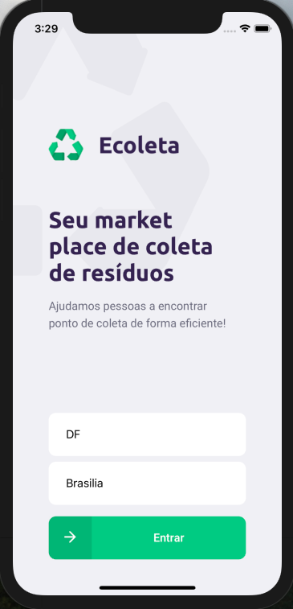
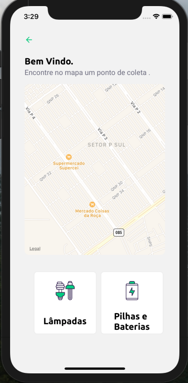
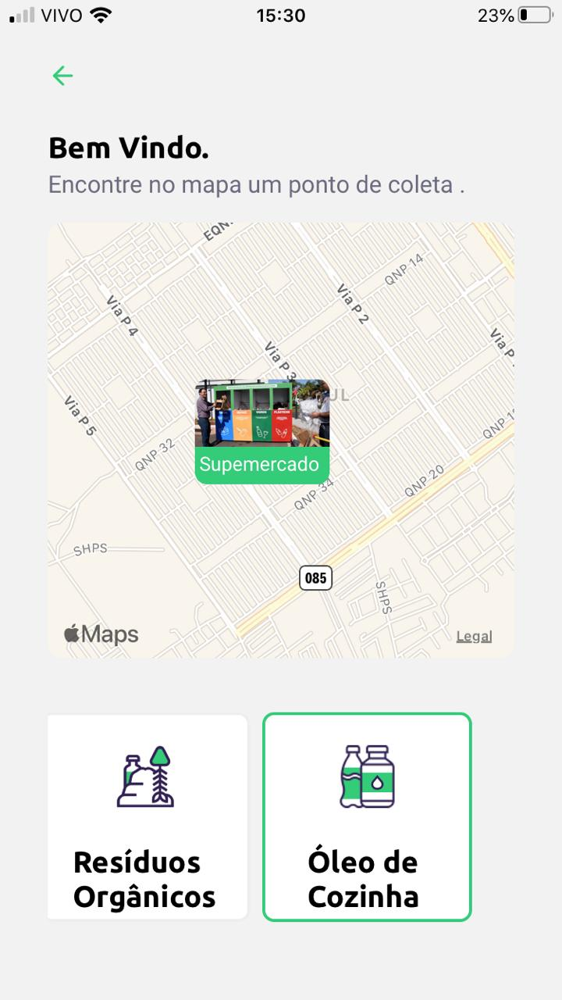
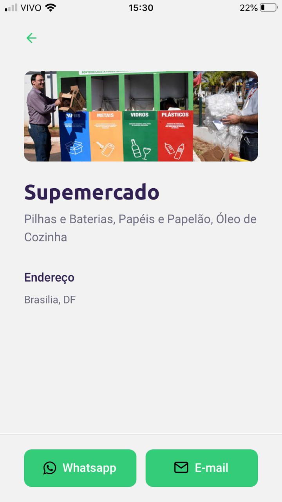

Ecoleta
Aplicação desenvolvida em uma semana de trainamento com a RocketSeat.
Essa aplicação tem Back-end em Node.Js, Bando de Dados Sqlite, e a lib do 
React.JS e React-Native.

Uma aplicação que agregou muito conhecimento e principalmente a introdução em TypeScript.

Installation
Use the package manager npm or yanr to install Ecoleta.
Rum Migration

contato: diegofernandes14@hotmail.com